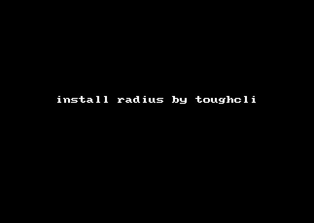
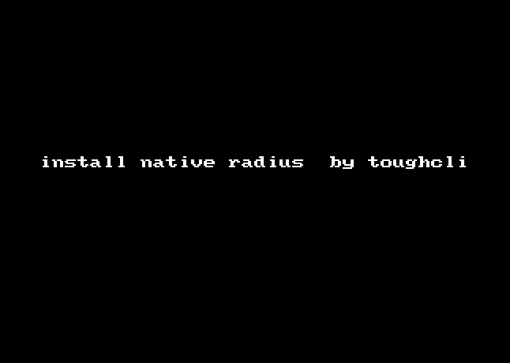
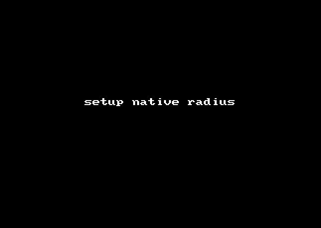

## 使用 toughcli 安装管理  toughradius

查看radius指令模块的帮助信息

    $ toughcli radius --help

    Usage: toughcli radius [OPTIONS]

        install toughradius by docker mode

    Options:

        --install
        -e, --edit-config               edit radius docker-compose.yml config
        -o, --docker-operate [|ps|config|pull|logs|start|stop|restart|kill|rm|down|pause|unpause|status|upgrade]
                                      docker instance operate
        -d, --rundir TEXT               default:/home/toughrun
        -i, --instance TEXT
        -n, --worker-num INTEGER
        -r, --release [dev|stable|commcial]
        --help                          Show this message and exit.

### 参数说明：

    --install 新安装 toughradius 实例，可选参数 -d,-i,-n,-r

    -e/--edit-config 编辑 toughcli 生成的 docker-compose配置文件，用来调整各项参数实现优化。可选参数 -d,-i

    -o/--docker-operate toughradius 实例的维护指令,可选参数 -d,-i

    子参数

    -d/--rundir 运行主目录，会在主目录中再次创建实例目录，一个主目录下可以安装多个实例。
    -i/--instance 实例名，可以创建多个 toughradius 实例，但必须保证端口不冲突。
    -n/--worker-num radius 工作进程数，保留参数，暂时没有起作用。
    -r/--release 安装版本，dev 开发版，stable 稳定版，commcial 商业版(保留参数)

### 示例

一键部署 TOUGHRADIUS，默认使用sqlite数据库

    $ toughcli radius --install  

指定实例名

    $ toughcli radius --install  -i r1 

指定版本类型

    $ toughcli radius --install -r dev 

### 本地安装模式

该安装模式不依赖 Docker，即采用了非 Docker 模式的部署，不建议新手使用，由于可能存在的 linux 发行版以及安装环境的差异，在安装过程中可能会出现不可预期的问题。任何用户都可以将安装过程中的问题向我们反馈，但我们不能承诺随时随地的解答。

    $ toughcli native_radius --install

完成上一步后，进入 /opt/toughradius 初始化数据库，并启动服务

    $ cd /opt/toughradius 
    $ make initdb
    $ service toughradius start

